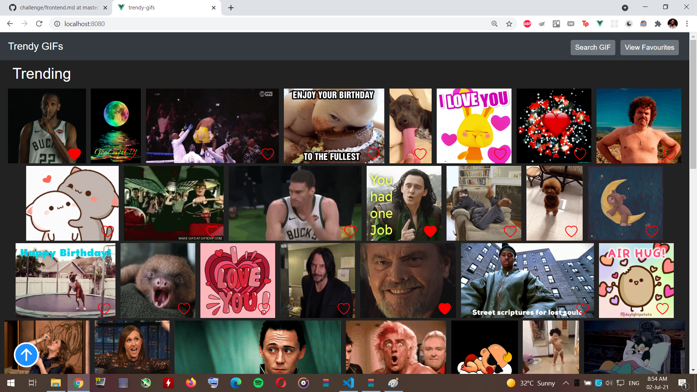
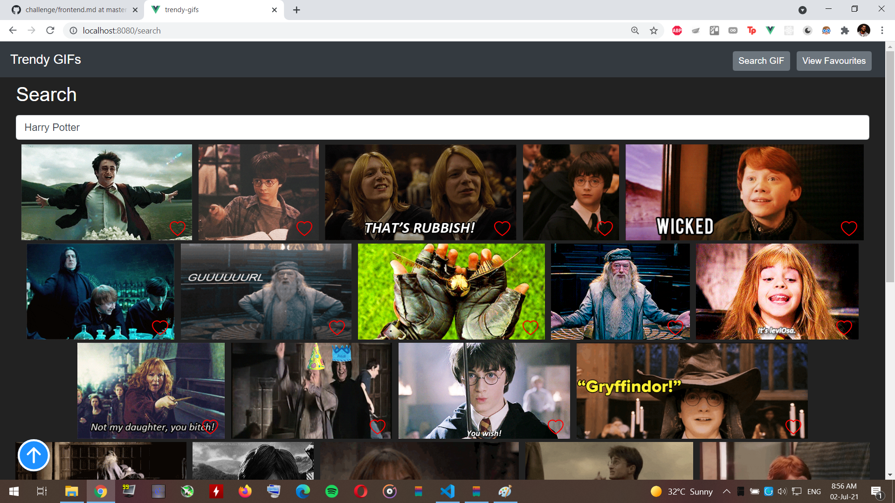
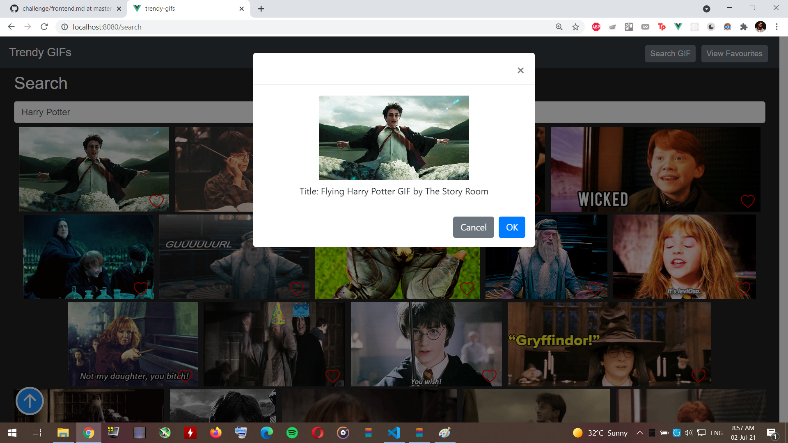

# TrendyGIFS

Deployed project link : https://trendygifs.herokuapp.com/

NB: For the commit history the master branch
## Setup for Local Testing

Pull the repo locally and open a terminal

### Frontend

1. Use a terminal to run the the command `npm i`
2. When the previous command is done run the the command `npm run serve`

Now the frontend is running on port 8080, to view the project open `http://localhost:8080/`

## Built With

* [Vue.js](https://vuejs.org/) (with vuex and vue-router)
* [Giphy API](https://developers.giphy.com/) (search, trending)

## Screenshots

## Trending Page

## Favourites Page

## Search Page and Popup

